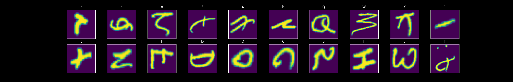

## 基本信息

数据集被切分为训练集（大小为 112800）和测试集（大小为 18800）

使用 `viridis` 作为映射量表后可视化的前20个数据如下，其中图像的 label 记录在每个子图的 title 区域：




## 优化超参数

一共有如下几个超参数需要优化：

1. 自适应学习率的 schedulers，可选：StepLR, ExponentialLR
2. 激活函数，可选：ReLU, LeakyReLU, ELU
3. 优化器，可选：SGD, Adam, RMSprop, Adagrad, ASGD
4. 使用 BN，可选： true, false
5. 正则范数，可选： L1, L2, None
6. Dropout，可选： true, false

此处假设上述若干超参对于优化结果是正交的，采用类似 ADMM 的方法进行交替优化：对于上面 6 种超参数，从 1 开始，每次只改变第 i 个因子的变量，其他的保持不变，穷举第 i 个因子的空间，找到使得最终效果最佳的因子的取值作为当前第 i 个因子选择的策略。

此处采用 4 折交叉验证作为交叉验证算法的度量。最终结果如下：

### CNN 超参数空间搜索结果

| 类型                    | 值            | 测试结果（准确率, 损失值） | 选为最佳 |
| ----------------------- | ------------- | -------------------------- | -------- |
| lr_scheduler            | ExponentialLR | (1.0, 15.619668602673105)  | n        |
| lr_scheduler            | StepLR        | (1.0, 13.25244172278986)   | y        |
| activation_function     | ELU           | (1.0, 15.637316745154711)  | y        |
| activation_function     | LeakyReLU     | (1.0, 16.12121235432268)   | n        |
| activation_function     | ReLU          | (1.0, 16.06570986393087)   | n        |
| optimizer_type          | ASGD          | (1.0, 17.12273691246569)   | n        |
| optimizer_type          | Adagrad       | (1.0, 15.602299744309754)  | n        |
| optimizer_type          | Adam          | (1.0, 14.63174570715076)   | n        |
| optimizer_type          | RMSprop       | (1.0, 11.456997974659581)  | y        |
| optimizer_type          | SGD           | (1.0, 17.121937025701648)  | n        |
| use_batch_normalization | True          | (1.0, 17.11335802348563)   | n        |
| use_batch_normalization | False         | (1.0, 15.819352854136167)  | y        |
| regularization          | L2            | (1.0, 5.572004884008377)   | n        |
| regularization          | none          | (1.0, 3.9114929326807832)  | y        |
| dropout_rate            | 0             | (1.0, 17.014227313519605)  | y        |
| dropout_rate            | 0.1           | (1.0, 17.117095237956836)  | n        |
| dropout_rate            | 0.5           | (1.0, 17.33389894708214)   | n        |

最终选择参数为：

- lr_scheduler: StepLR

- activation_function: ELU
- optimizer_type: RMSprop
- use_batch_normalization: False
- regularization: none
- dropout_rate: 0

### MLP 超参数搜索结果

| 类型                    | 值            | 测试结果（准确率, 损失值） | 选为最佳 |
| ----------------------- | ------------- | -------------------------- | -------- |
| lr_scheduler            | ExponentialLR | (1.0, 15.074724356874048)  | n        |
| lr_scheduler            | StepLR        | (1.0, 12.635740499647836)  | y        |
| activation_function     | ELU           | (1.0, 15.09217919081517)   | y        |
| activation_function     | LeakyReLU     | (1.0, 15.47391676254013)   | n        |
| activation_function     | ReLU          | (1.0, 15.4565707604631)    | n        |
| optimizer_type          | ASGD          | (1.0, 16.279444574498804)  | n        |
| optimizer_type          | Adagrad       | (1.0, 15.219991266592288)  | n        |
| optimizer_type          | Adam          | (1.0, 15.077001053189475)  | n        |
| optimizer_type          | RMSprop       | (1.0, 12.39062147400006)   | y        |
| optimizer_type          | SGD           | (1.0, 16.298378194000176)  | n        |
| use_batch_normalization | True          | (1.0, 16.281248032100617)  | n        |
| use_batch_normalization | False         | (1.0, 15.225514909848066)  | y        |
| regularization          | L1            | (1.0, 16.28108634754103)   | n        |
| regularization          | L2            | (1.0, 5.216115949645875)   | n        |
| regularization          | none          | (1.0, 4.022819705966379)   | y        |
| dropout_rate            | 0             | (1.0, 16.25941619418916)   | y        |
| dropout_rate            | 0.1           | (1.0, 16.26675824189132)   | n        |
| dropout_rate            | 0.5           | (1.0, 16.454123040716123)  | n        |

最终选择参数为：

- lr_scheduler: StepLR

- activation_function: ELU
- optimizer_type: RMSprop
- use_batch_normalization: False
- regularization: none
- dropout_rate: 0


## 训练策略

将上述得到的结果装载进入 `./code/config` 的文件后，先运行带有 lr scheduler 的，然后取消 scheduler 再继续训练。


## 实验结果


### CNN

train & accuracy 曲线


test 前 6 个数据的预测结果


test 上的混淆矩阵


test 准确率

0.8582446808510639

precision, recall and F1 score

```
          precision    recall  f1-score   support

           0       0.69      0.37      0.48       400
           1       0.53      0.65      0.58       400
           2       0.89      0.86      0.88       400
           3       0.96      0.98      0.97       400
           4       0.94      0.87      0.90       400
           5       0.92      0.92      0.92       400
           6       0.92      0.91      0.92       400
           7       0.97      0.97      0.97       400
           8       0.93      0.88      0.90       400
           9       0.64      0.81      0.71       400
          10       0.91      0.96      0.94       400
          11       0.95      0.93      0.94       400
          12       0.89      0.95      0.92       400
          13       0.92      0.86      0.89       400
          14       0.96      0.96      0.96       400
          15       0.62      0.60      0.61       400
          16       0.90      0.94      0.92       400
          17       0.91      0.97      0.94       400
          18       0.60      0.65      0.62       400
          19       0.95      0.90      0.93       400
          20       0.96      0.96      0.96       400
          21       0.62      0.44      0.51       400
          22       0.97      0.94      0.95       400
          23       0.92      0.96      0.94       400
          24       0.54      0.86      0.67       400
          25       0.94      0.96      0.95       400
          26       0.92      0.89      0.91       400
          27       0.95      0.93      0.94       400
          28       0.90      0.92      0.91       400
          29       0.89      0.94      0.91       400
          30       0.90      0.94      0.92       400
          31       0.95      0.90      0.92       400
          32       0.98      0.99      0.99       400
          33       0.95      0.94      0.95       400
          34       0.90      0.90      0.90       400
          35       0.91      0.88      0.89       400
          36       0.86      0.89      0.87       400
          37       0.89      0.92      0.90       400
          38       0.97      0.95      0.96       400
          39       0.98      0.91      0.94       400
          40       0.59      0.59      0.59       400
          41       0.69      0.65      0.67       400
          42       0.91      0.94      0.93       400
          43       0.91      0.89      0.90       400
          44       0.72      0.47      0.56       400
          45       0.90      0.94      0.92       400
          46       0.88      0.91      0.89       400

    accuracy                           0.86     18800
   macro avg       0.86      0.86      0.86     18800
weighted avg       0.86      0.86      0.86     18800
```


### MLP

train & accuracy 曲线


test 前 6 个数据的预测结果


test 上的混淆矩阵


test 准确率

0.8582446808510639

precision, recall and F1 score

```
          precision    recall  f1-score   support

           0       0.69      0.37      0.48       400
           1       0.53      0.65      0.58       400
           2       0.89      0.86      0.88       400
           3       0.96      0.98      0.97       400
           4       0.94      0.87      0.90       400
           5       0.92      0.92      0.92       400
           6       0.92      0.91      0.92       400
           7       0.97      0.97      0.97       400
           8       0.93      0.88      0.90       400
           9       0.64      0.81      0.71       400
          10       0.91      0.96      0.94       400
          11       0.95      0.93      0.94       400
          12       0.89      0.95      0.92       400
          13       0.92      0.86      0.89       400
          14       0.96      0.96      0.96       400
          15       0.62      0.60      0.61       400
          16       0.90      0.94      0.92       400
          17       0.91      0.97      0.94       400
          18       0.60      0.65      0.62       400
          19       0.95      0.90      0.93       400
          20       0.96      0.96      0.96       400
          21       0.62      0.44      0.51       400
          22       0.97      0.94      0.95       400
          23       0.92      0.96      0.94       400
          24       0.54      0.86      0.67       400
          25       0.94      0.96      0.95       400
          26       0.92      0.89      0.91       400
          27       0.95      0.93      0.94       400
          28       0.90      0.92      0.91       400
          29       0.89      0.94      0.91       400
          30       0.90      0.94      0.92       400
          31       0.95      0.90      0.92       400
          32       0.98      0.99      0.99       400
          33       0.95      0.94      0.95       400
          34       0.90      0.90      0.90       400
          35       0.91      0.88      0.89       400
          36       0.86      0.89      0.87       400
          37       0.89      0.92      0.90       400
          38       0.97      0.95      0.96       400
          39       0.98      0.91      0.94       400
          40       0.59      0.59      0.59       400
          41       0.69      0.65      0.67       400
          42       0.91      0.94      0.93       400
          43       0.91      0.89      0.90       400
          44       0.72      0.47      0.56       400
          45       0.90      0.94      0.92       400
          46       0.88      0.91      0.89       400

    accuracy                           0.86     18800
   macro avg       0.86      0.86      0.86     18800
weighted avg       0.86      0.86      0.86     18800
```